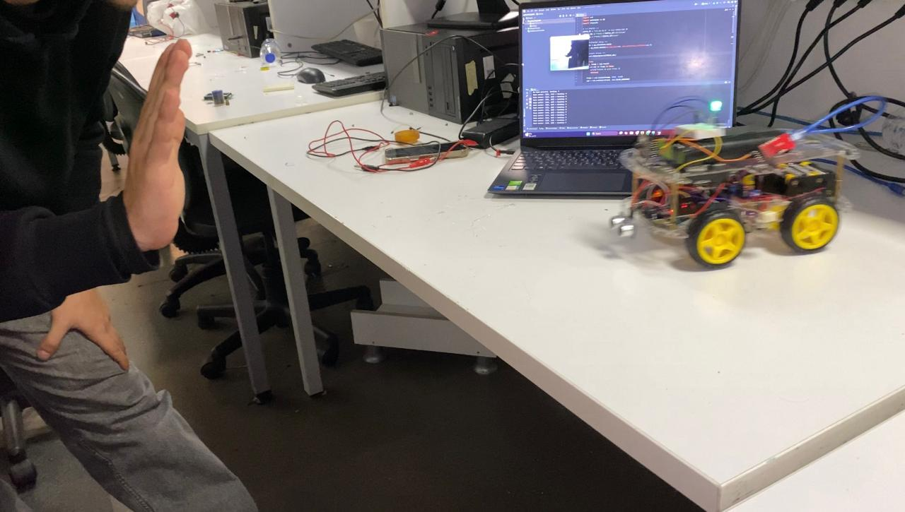
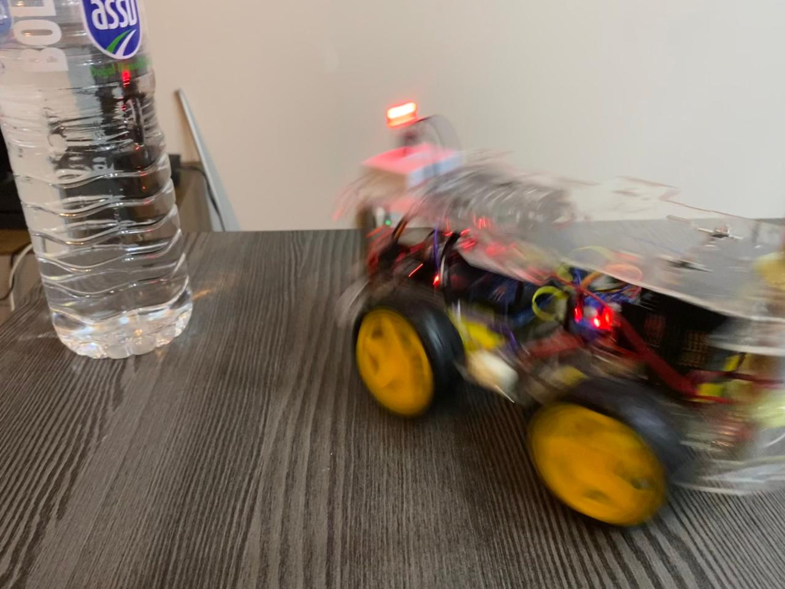

# 🤖 ESP32-CAM AI Follow-Me Robot

An AI-powered mobile robot that tracks a human hand using real-time computer vision and responds with autonomous movement, obstacle avoidance, and wireless control. Built using the ESP32-CAM module, Arduino Mega, and Python-based control via Gradio.

---

## 🚀 Project Overview

This project demonstrates the integration of embedded systems, computer vision, and web technologies to build a smart robot capable of:

* 👋 Following a user's hand using MediaPipe & OpenCV
* 🚧 Avoiding obstacles in real time using an ultrasonic sensor
* 🎮 Switching to manual control via a custom web UI (Gradio)
* 🤖 Entering Random Personality Mode after idle time
* 💃 Executing a Dance Mode upon user command
* 🔴 Displaying RGB LED status feedback

---

## 🧠 System Architecture

User Hand → ESP32-CAM → Laptop (Python + MediaPipe) → ESP32-CAM (HTTP) → Arduino Mega (Serial) → Motors + Sensors

See `images/architecture_diagram.png` for the full visual flow.

---

## 🔌 Hardware Components

| Component          | Purpose                                  |
| ------------------ | ---------------------------------------- |
| ESP32-CAM          | Video stream + receives HTTP commands    |
| Arduino Mega       | Controls motors, sensors, and LED        |
| L298N Motor Driver | Drives 4 DC motors                       |
| HC-SR04 Sensor     | Detects obstacles < 20cm                 |
| RGB LED            | Visual feedback for system status        |
| 4x DC Motors       | Movement (forward, backward, turn)       |
| Battery & Switches | Power logic and motor systems separately |

---

## 💻 Software Stack

* **Python 3.10+**

  * `MediaPipe` – for hand tracking
  * `OpenCV` – for video frame processing
  * `Gradio` – for web UI
  * `Requests` – for HTTP communication

* **Arduino IDE**

  * Serial command reading
  * Obstacle logic and motor control

---

## 📁 File Structure

📄 hand\_tracking.py  # 🖐️ Detects hand using MediaPipe and sends movement commands to the robot

📄 robot\_ui.py  # 🌐 Gradio web interface for manual robot control

📄 arduino\_code.ino  # 🔧 Arduino Mega code controlling motors, sensors, and RGB LED

📁 images/  # 🖼️ Contains architecture diagram and robot demonstration images

---

## 🎥 Demo Highlights

| Mode               | Description                              |
| ------------------ | ---------------------------------------- |
| Follow-Me Mode     | Tracks hand using landmark coordinates   |
| Obstacle Avoidance | Stops and turns when < 20cm object ahead |
| Random Personality | Randomly moves if no hand for 30+ secs   |
| Dance Mode         | Spins and moves in a preset pattern      |

---

## 👥 Team Members

* Abdullah Hani Abdellatif Al-Shobaki – 2284612
* Mohamed Aiman Mohamed Alkozendar – 2283149
* Mohammed Ahmed Mohammed Al-labani – 2105990

Special thanks to:

* **Prof. Mahmut Ağan** – Project Supervisor
* **Fahd Al-Sattaf** – Hardware support & wiring

---

## 📚 References

* [MediaPipe – Google Research](https://github.com/google/mediapipe)
* [OpenCV](https://opencv.org)
* [ESP32-CAM Documentation](https://docs.espressif.com/projects/esp-idf/en/latest/esp32/hw-reference/esp32/get-started-cam.html)
* [Gradio](https://www.gradio.app)
* [HC-SR04 Datasheet](https://components101.com/sensors/hc-sr04-ultrasonic-sensor)
* [ChatGPT-4o – OpenAI](https://chat.openai.com)

---

## 📌 License

This project is for educational purposes only.
